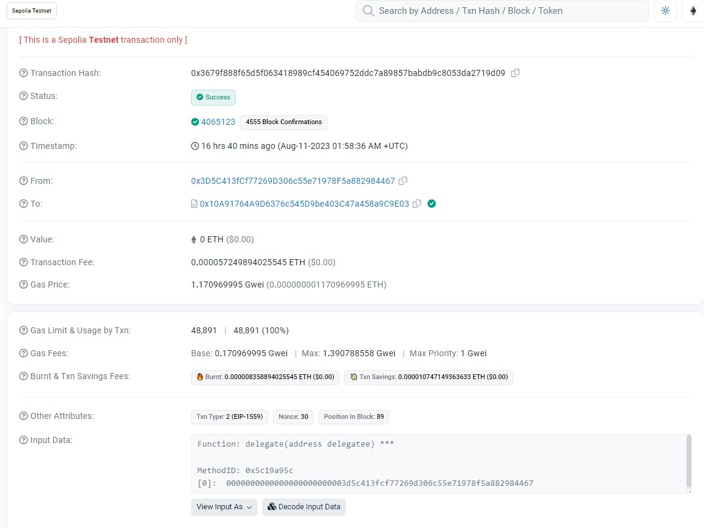
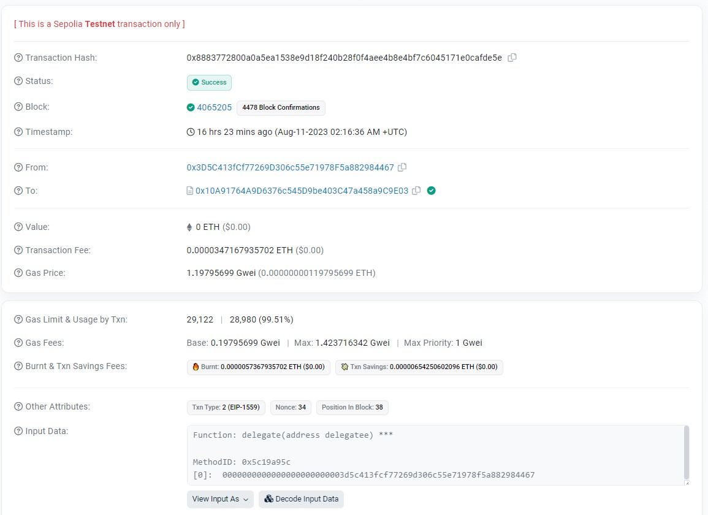
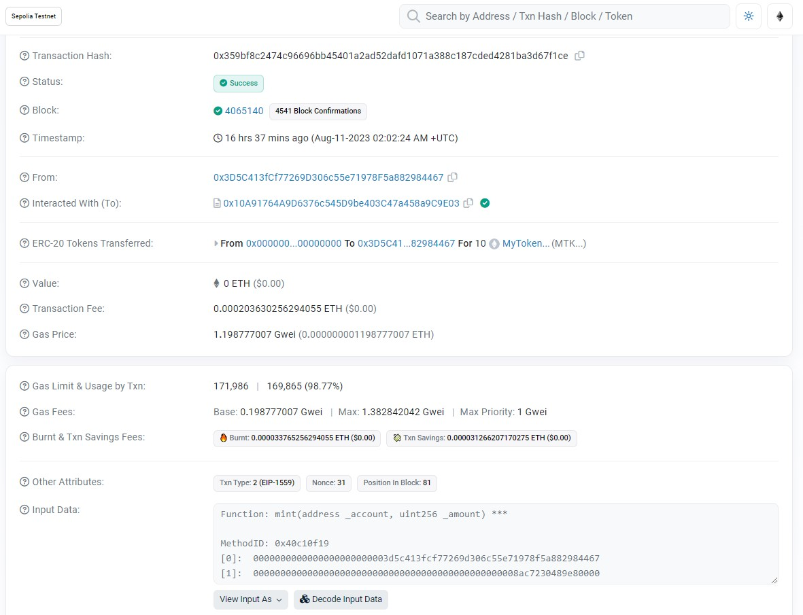

# Tokenized Ballot System

Tokenized Ballot System is a decentralized voting system built on Ethereum. It leverages smart contracts and allows participants to cast votes, delegate voting power, check voting power, mint tokens, query results, and deploy voting contracts.

This project was developed as a group activity for at least three students, and the details of the task can be found below.

## Table of Contents

1. [Contract](#contract)
2. [Scripts](#scripts)
   - [Casting Votes](#casting-votes)
   - [Checking Vote Power](#checking-vote-power)
   - [Delegating Voting Power](#delegating-voting-power)
   - [Deploy Ballot Contracts](#deploy-ballot-contracts)
   - [Mint Tokens](#mint-tokens)
   - [Querying Results](#querying-results)
3. [Installation](#installation)
4. [Usage](#usage)
5. [Snapshots](#snapshots)
6. [License](#license)

## Contract

The `TokenizedBallot.sol` contract contains the main logic for managing proposals, votes, and voting power. It is implemented in Solidity and makes use of OpenZeppelin's Math library.

## Scripts

### Casting Votes

The `CastingVotes.ts` script handles the functionality of attaching to a Tokenized Ballot contract and casting a vote to a specific proposal.

### Checking Vote Power

`CheckingVotePower.ts` is responsible for attaching to a Tokenized Ballot contract and checking the voting power of a specific voter address.

### Delegating Voting Power

In the `DelegatingVotingPower.ts` script, users can delegate their voting power to another address.

### Deploy Ballot Contracts

`DeployBallotContracts.ts` is a script that allows users to deploy the Tokenized Ballot contracts with predefined proposals.

### Mint Tokens

`Mint.ts` provides functionality for minting tokens to a specific address.

### Querying Results

With `QueryingResults.ts`, users can query the winner's name from the Tokenized Ballot contract.

## Installation

Clone the repository and install dependencies:

```bash
git clone <repository_url>
cd <repository_directory>
npm install
```

## Usage

You can run the individual scripts using the following command:

```bash
npx hardhat run scripts/<script_name>.ts
```

Make sure to replace `<script_name>` with the appropriate script name.

## Snapshots






## License

This project is licensed under the MIT License. See the [LICENSE](LICENSE) file for details.

---

This README provides an overview of the project, including a description of the different scripts, installation instructions, and usage guidance. Feel free to modify or add to it as needed!
